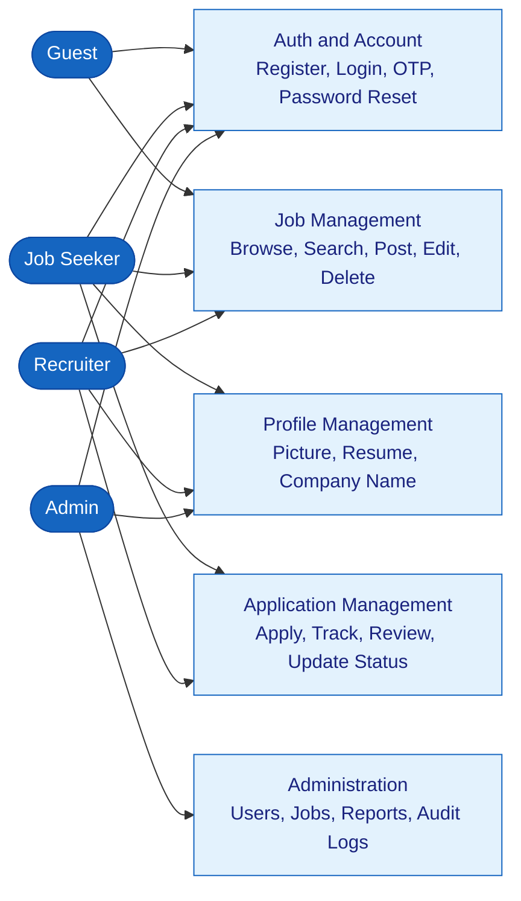
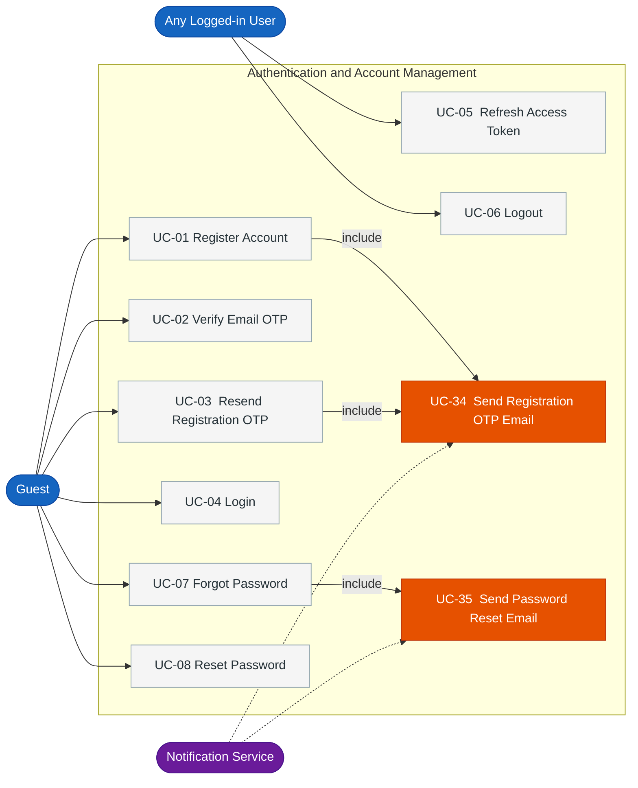
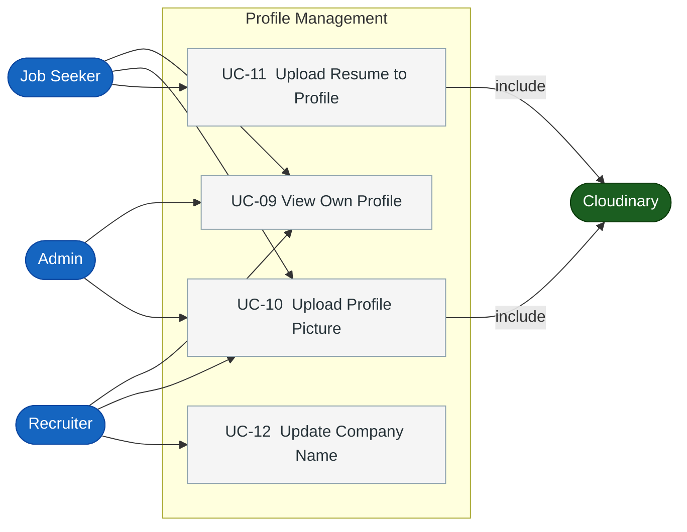
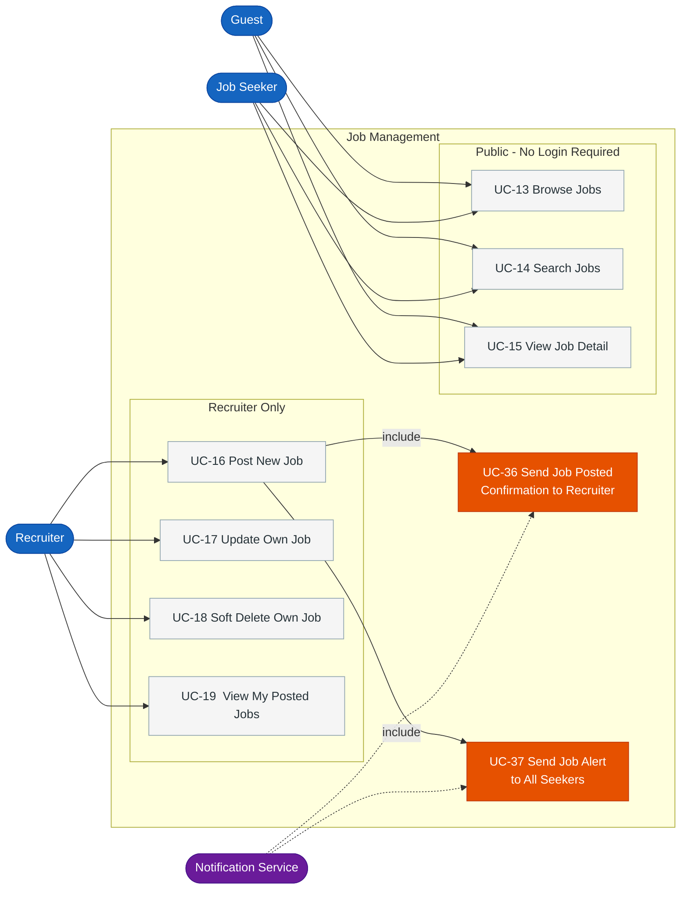
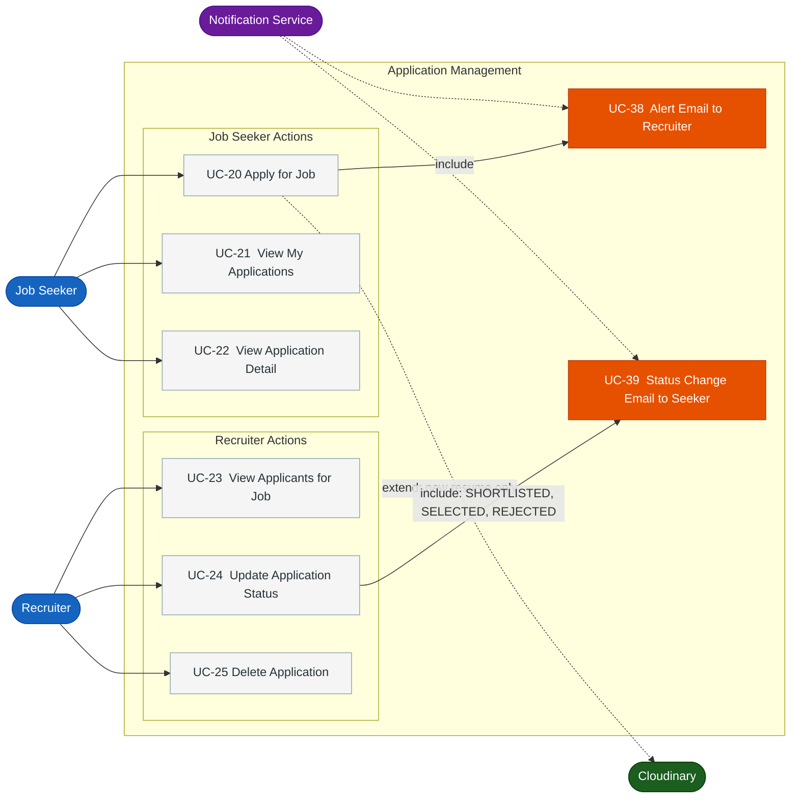
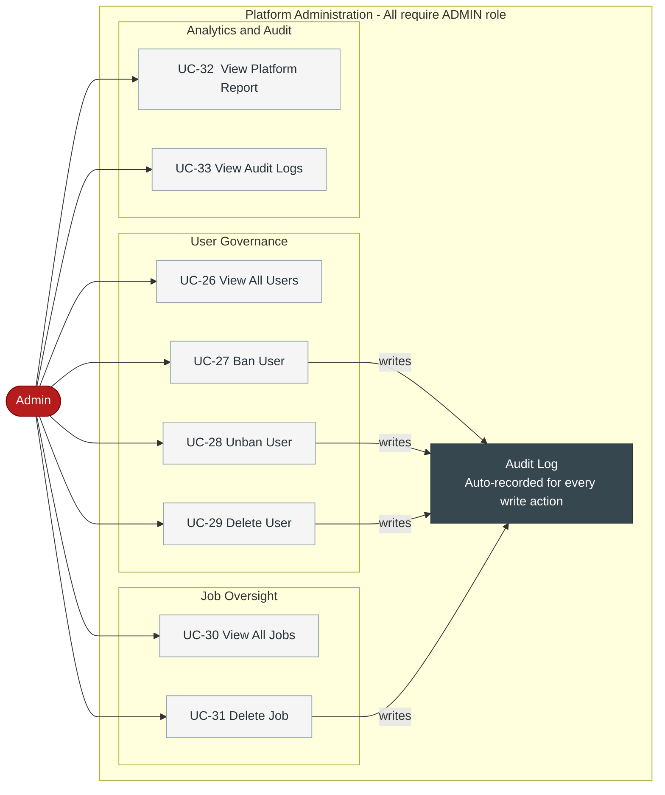
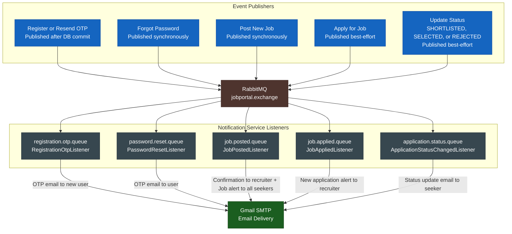
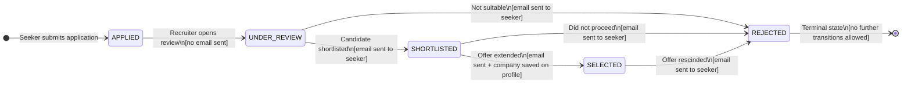

# Use Case Analysis — Joblix Job Portal Management System

---

## 1. Actor Definitions

| Actor | Role |
|---|---|
| **Guest** | Unauthenticated user — public read-only access |
| **Job Seeker** | Verified user — browses jobs, applies, tracks applications |
| **Recruiter** | Verified user — posts jobs, manages applicants |
| **Admin** | Platform supervisor — governance, bans, reports |
| **Notification Service** | Internal system — sends automated emails via RabbitMQ |
| **Cloudinary** | External storage — profile pictures and resumes |

---

## 2. Use Case Tables

### Authentication & Account

| ID | Use Case | Actor | Key Rule |
|---|---|---|---|
| UC-01 | Register Account | Guest | ADMIN role blocked; re-registers PENDING accounts |
| UC-02 | Verify Email OTP | Guest | 10-min OTP; moves account to ACTIVE |
| UC-03 | Resend Registration OTP | Guest | Only for PENDING_VERIFICATION accounts |
| UC-04 | Login | Guest | Blocks BANNED and PENDING accounts |
| UC-05 | Refresh Access Token | Any User | DB-backed UUID; rotated on every use |
| UC-06 | Logout | Any User | Clears refresh token from DB |
| UC-07 | Forgot Password | Guest | 6-digit OTP; 10-min expiry |
| UC-08 | Reset Password | Guest | Validates OTP; clears OTP fields after success |

### Profile Management

| ID | Use Case | Actor | Key Rule |
|---|---|---|---|
| UC-09 | View Own Profile | Any User | Reads by X-User-Id header |
| UC-10 | Upload Profile Picture | Any User | Uploaded to Cloudinary |
| UC-11 | Upload Resume to Profile | Job Seeker | Stored as resume_url on user record |
| UC-12 | Update Company Name | Recruiter | Trimmed before save |

### Job Management

| ID | Use Case | Actor | Key Rule |
|---|---|---|---|
| UC-13 | Browse Jobs | Guest / Any | Paginated; excludes DELETED |
| UC-14 | Search Jobs | Guest / Any | Filter by title, location, type, experience |
| UC-15 | View Job Detail | Guest / Any | Returns 404 for DELETED jobs |
| UC-16 | Post New Job | Recruiter | Role checked at service layer |
| UC-17 | Update Own Job | Recruiter | Ownership verified: postedBy == userId |
| UC-18 | Soft Delete Own Job | Recruiter | Sets status=DELETED; stays in DB |
| UC-19 | View My Posted Jobs | Recruiter | Paginated; excludes DELETED |

### Application Management

| ID | Use Case | Actor | Key Rule |
|---|---|---|---|
| UC-20 | Apply for Job | Job Seeker | Validates job status, deadline, no duplicates |
| UC-21 | View My Applications | Job Seeker | All statuses |
| UC-22 | View Application Detail | Job Seeker | Own applications only |
| UC-23 | View Applicants for Job | Recruiter | Job ownership verified |
| UC-24 | Update Application Status | Recruiter | Strict state machine enforced |
| UC-25 | Delete Application | Recruiter | Hard delete; ownership required |

### Platform Administration

| ID | Use Case | Actor | Key Rule |
|---|---|---|---|
| UC-26 | View All Users | Admin | Via Feign to Auth Service |
| UC-27 | Ban User | Admin | Self-ban blocked; token invalidated; audit logged |
| UC-28 | Unban User | Admin | Restores ACTIVE status; audit logged |
| UC-29 | Delete User | Admin | Hard delete via Feign; audit logged |
| UC-30 | View All Jobs | Admin | Includes DELETED jobs |
| UC-31 | Delete Job | Admin | Soft-delete via Feign; audit logged |
| UC-32 | View Platform Report | Admin | 3 sequential Feign calls |
| UC-33 | View Audit Logs | Admin | All admin action history |

### Notifications (System-Driven)

| ID | Use Case | Trigger | Queue |
|---|---|---|---|
| UC-34 | Send Registration OTP Email | Register / Resend | registration.otp.queue |
| UC-35 | Send Password Reset Email | Forgot Password | password.reset.queue |
| UC-36 | Send Job Posted Confirmation | Post New Job | job.posted.queue |
| UC-37 | Send Job Alert to All Seekers | Post New Job | job.posted.queue |
| UC-38 | Send Application Alert to Recruiter | Apply for Job | job.applied.queue |
| UC-39 | Send Status Change Email to Seeker | Update Status | application.status.queue |

---

## 3. Use Case Diagrams

---

### Diagram 1 — System Actor Overview

---

### Diagram 2 — Authentication and Account Management

---

### Diagram 3 — Profile Management

---

### Diagram 4 — Job Management

---

### Diagram 5 — Application Management

---

### Diagram 6 — Platform Administration

---

### Diagram 7 — Event-Driven Notification Flow

---

## 4. Application Status State Machine

> Core business rule enforced by `validateStatusTransition()` in Application Service.

---

## 5. Include / Extend Summary

| From | Relationship | To | When |
|---|---|---|---|
| UC-01 Register | include | UC-34 Registration OTP Email | Always |
| UC-03 Resend OTP | include | UC-34 Registration OTP Email | Always |
| UC-07 Forgot Password | include | UC-35 Password Reset Email | Always |
| UC-16 Post New Job | include | UC-36 Recruiter Confirmation | Always |
| UC-16 Post New Job | include | UC-37 Seeker Job Alert | Always |
| UC-20 Apply for Job | include | UC-38 Recruiter Alert | Always (best-effort) |
| UC-24 Update Status | include | UC-39 Seeker Status Email | Only SHORTLISTED / SELECTED / REJECTED |
| UC-10 Upload Picture | include | Cloudinary | Always |
| UC-11 Upload Resume | include | Cloudinary | Always |
| UC-20 Apply for Job | extend | Cloudinary | Only when uploading a new resume |
