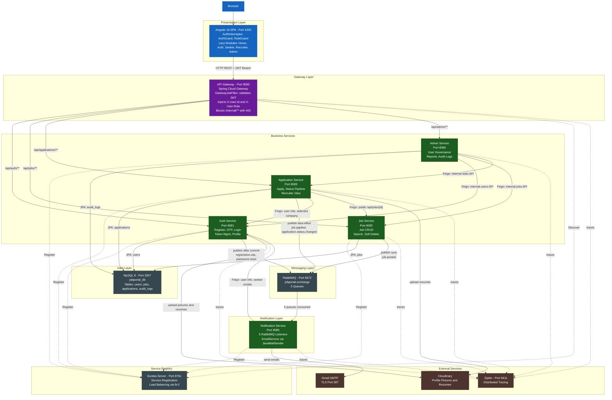

# High Level Design (HLD) — Joblix Job Portal Management System

---

## 1. System Overview

**Joblix** (JPMS — Job Portal Management System) is a full-stack, enterprise-grade digital recruitment platform. The backend is built on Spring Boot 3.x microservices with a reactive Spring Cloud Gateway, and the frontend is an Angular 19+ SPA. It covers the complete hiring lifecycle from registration through job discovery, application submission, recruiter pipeline management, and automated event-driven email notifications.

---

## 2. Problem Statement

Traditional recruitment processes are fragmented: job seekers manually track applications, recruiters manage candidate pipelines in spreadsheets, and administrators lack real-time platform visibility. Manual email communication is inconsistent and error-prone.

**Joblix solves this by providing:**
- Centralized job listings with structured search and filtering.
- OTP-secured account registration and password recovery.
- Status-tracked application pipeline with enforced state transitions.
- Fully automated, asynchronous email notifications via RabbitMQ.
- Admin governance with audit trails and platform-wide analytics.

---

## 3. Objectives

| Objective | Implementation |
|---|---|
| Secure authentication | BCrypt hashing + JWT (HMAC-SHA256) + UUID refresh token with DB-backed rotation |
| Email verification on registration | 6-digit OTP published via RabbitMQ after DB commit using `TransactionSynchronization.afterCommit()` |
| Role-based access control | Gateway injects `X-User-Id` / `X-User-Role`; each service asserts role locally |
| Admin cannot self-register | Blocked at code level in `AuthService.register()` |
| Event-driven notifications | 5 RabbitMQ queues on `jobportal.exchange`; NotificationService is the sole consumer |
| Cloud file storage | Cloudinary SDK used by AuthService (profile pics + resumes) and ApplicationService (application resumes) |
| Structured application pipeline | `validateStatusTransition()` enforces a strict DAG; terminal REJECTED state blocks further changes |
| Platform governance | AdminService orchestrates Feign calls to all services + writes to `audit_logs` |
| Full-stack deployment | Docker Compose with health-check ordering across 11 containers |

---

## 4. Core Business Modules

| Module | Service | Port | Responsibility |
|---|---|---|---|
| Authentication and Identity | Auth Service | 8081 | Registration, OTP lifecycle, login, token management, profile management, internal user API |
| Job Catalog | Job Service | 8082 | Job CRUD, search/filter with pagination, soft-delete, internal admin API |
| Application Pipeline | Application Service | 8083 | Apply flow, status machine, resume upload, recruiter view, internal stats API |
| Platform Administration | Admin Service | 8084 | User governance, job oversight, platform report, audit log |
| Event Notifications | Notification Service | 8085 | RabbitMQ consumer — 5 listeners -> EmailService -> Gmail SMTP |
| API Routing and Security | API Gateway | 9090 | JWT filter, header injection, route dispatch, CORS, internal path blocking |
| Service Registry | Eureka Server | 8761 | Service registration and client-side load balancing |

---

## 5. Functional Requirements (Code-Verified)

### FR-AUTH: Authentication

| ID | Requirement |
|---|---|
| FR-01 | Registration supports roles JOB_SEEKER and RECRUITER only; ADMIN role registration throws exception |
| FR-02 | Registration creates user with PENDING_VERIFICATION status; OTP sent only after DB transaction commits |
| FR-03 | If email exists and is PENDING_VERIFICATION, re-registration updates all fields and refreshes OTP |
| FR-04 | Email verification OTP expires in 10 minutes; resend generates a new OTP and overwrites old |
| FR-05 | Login rejects accounts with BANNED ("Account suspended") or PENDING_VERIFICATION ("EMAIL_NOT_VERIFIED") status |
| FR-06 | Login returns: accessToken, refreshToken, role, userId, name, email |
| FR-07 | Refresh token is UUID-based, stored in DB, and rotated on every use (new pair issued) |
| FR-08 | Logout clears users.refresh_token to null |
| FR-09 | Forgot-password generates 6-digit OTP (10-min expiry); published synchronously (not after-commit) |
| FR-10 | Reset-password validates OTP + expiry; clears both OTP and expiry fields after success |

### FR-APP: Application Management

| ID | Requirement |
|---|---|
| FR-23 | Duplicate application check: existsByUserIdAndJobId throws DuplicateApplicationException (409) |
| FR-24 | Application validates: job not DELETED/CLOSED, deadline not before LocalDate.now() |
| FR-25 | Resume required: either useExistingResume=true (must provide URL) or false (must upload file) |
| FR-26 | Notification on apply is best-effort: failure caught as WARN log, application still succeeds |
| FR-28 | Status update requires job ownership: job.postedBy == recruiterId |
| FR-29 | Status machine terminal state: REJECTED blocks all further transitions |
| FR-30 | Only SHORTLISTED, SELECTED, REJECTED statuses trigger ApplicationStatusChangedEvent; UNDER_REVIEW does NOT |
| FR-31 | SELECTED status additionally calls authServiceClient.updateSelectedByCompany() via Feign |
| FR-32 | getApplicationStats() counts APPLIED, UNDER_REVIEW, SHORTLISTED, REJECTED — SELECTED is omitted from counts |

### FR-ADMIN: Administration

| ID | Requirement |
|---|---|
| FR-34 | All admin endpoints enforce assertAdmin(role) check at controller level |
| FR-35 | Ban: self-ban blocked; calls banUser() + invalidateToken() on Auth; token invalidation failure is WARN-only |
| FR-36 | Admin delete job: calls Feign to DELETE /api/internal/jobs/{id} — soft-delete in JobService |
| FR-37 | Platform report: sequential Feign calls to Auth + Job + Application services |
| FR-38 | All admin actions (BAN_USER, UNBAN_USER, DELETE_USER, DELETE_JOB) are recorded in audit_logs |

---

## 6. Non-Functional Requirements

### Security
- Passwords stored as BCrypt hashes.
- JWT tokens: HMAC-SHA256 signed; access token ~2.5h TTL; refresh token ~7 days, DB-backed.
- Gateway blocks all `/api/internal/**` with 403 for external clients.
- Role enforced twice: Gateway header injection + service-layer assertion.
- OTP expires in 10 minutes; OTP fields null-cleared after use.

### Performance
- Read operations use Spring Data `Pageable` to avoid full table scans.
- Notification delivery is fully asynchronous via RabbitMQ — never blocks API responses.

### Reliability
- Docker health checks enforce correct startup order.
- ApplicationService notification failures are caught: app creation always succeeds even if RabbitMQ is down.
- RabbitMQ persistence via `rabbitmq-data` Docker volume.

---

## 7. System Architecture Layers

---

## 8. Inter-Module Communication

### Synchronous (OpenFeign via Eureka — bypasses Gateway)

| Caller | Target Service | Method | Path | Purpose |
|---|---|---|---|---|
| Admin Service | auth-service | GET | `/api/internal/users` | Get all users |
| Admin Service | auth-service | DELETE | `/api/internal/users/{id}` | Hard-delete user |
| Admin Service | auth-service | PUT | `/api/internal/users/{id}/ban` | Set status=BANNED |
| Admin Service | auth-service | PUT | `/api/internal/users/{id}/unban` | Set status=ACTIVE |
| Admin Service | auth-service | PUT | `/api/internal/users/{id}/invalidate-token` | Clear refreshToken |
| Admin Service | job-service | GET | `/api/internal/jobs/all` | Get all jobs including DELETED |
| Admin Service | job-service | DELETE | `/api/internal/jobs/{id}` | Soft-delete job |
| Admin Service | application-service | GET | `/api/internal/applications/stats` | Get application counts |
| App Service | auth-service | GET | `/api/internal/users/{id}/info` | Get seeker name/email |
| App Service | auth-service | PUT | `/api/internal/users/{seekerId}/selected-company` | Set selectedByCompany |
| App Service | job-service | GET | `/api/jobs/{id}` | Validate job — **public endpoint, not internal** |
| Notification Service | auth-service | GET | `/api/internal/users/{id}/info` | Get recruiter info |
| Notification Service | auth-service | GET | `/api/internal/users/job-seeker-emails` | Get all active seeker emails |

### Asynchronous (RabbitMQ AMQP)

| Event | Routing Key | Publisher | Queue | Consumer |
|---|---|---|---|---|
| JobPostedEvent | job.posted | Job Service | job.posted.queue | JobPostedListener |
| JobAppliedEvent | job.applied | App Service | job.applied.queue | JobAppliedListener |
| ApplicationStatusChangedEvent | application.status.changed | App Service | application.status.queue | ApplicationStatusChangedListener |
| PasswordResetEvent | password.reset | Auth Service | password.reset.queue | PasswordResetListener |
| RegistrationOtpEvent | registration.otp | Auth Service | registration.otp.queue | RegistrationOtpListener |

---

## 9. Security Model

| Layer | Mechanism | Detail |
|---|---|---|
| Gateway filter | GatewayJwtFilter | Runs at Order=-1; validates HMAC-SHA256 JWT |
| Token sharing | Shared secret | API_GATEWAY_JWT_SECRET equals AUTH_SERVICE_JWT_SECRET in .env |
| Header injection | X-User-Id / X-User-Role | Gateway extracts from JWT claims; downstream services read headers |
| Service-layer assertion | Role check | assertAdmin(role) in AdminController; role check in JobService |
| Internal API protection | 403 on /api/internal/** | GatewayJwtFilter blocks before any auth check |
| OTP security | 6-digit, 10-min expiry | Fields null-cleared after use |
| Token rotation | Refresh token | New UUID pair on every /api/auth/refresh call |
| Ban enforcement | status=BANNED + clear refreshToken | Forces logout; login blocked by status check |
| Self-ban prevention | id.equals(adminId) check | In AdminService.banUser() |

---

## 10. Deployment Overview

| Container | Port | Health Check | Depends On |
|---|---|---|---|
| eureka-server | 8761 | GET /actuator/health | — |
| zipkin | 9411 | GET /health | — |
| jobportal-db | 3307 | mysqladmin ping | — |
| rabbitmq | 5672, 15672 | rabbitmq-diagnostics ping | — |
| api-gateway | 9090 | GET /actuator/health | eureka, zipkin |
| auth-service | 8081 | GET /actuator/health | db, rabbitmq, eureka, zipkin |
| job-service | 8082 | GET /actuator/health | db, rabbitmq, eureka, zipkin |
| application-service | 8083 | GET /actuator/health | db, rabbitmq, eureka, zipkin |
| admin-service | 8084 | GET /actuator/health | db, eureka, auth, job, app, zipkin |
| notification-service | 8085 | none | rabbitmq, eureka, zipkin |
| jpms-frontend | 4200 to 80 | — | api-gateway |

---

## 11. Key Technical Constraints

| Category | Fact |
|---|---|
| Admin job delete | Soft-delete (status=DELETED) — NOT a hard DB delete |
| getApplicationStats() | Counts APPLIED, UNDER_REVIEW, SHORTLISTED, REJECTED only — SELECTED is omitted |
| JobService RabbitMQ publish | Synchronous — immediately after save(), not after-commit |
| AuthService RabbitMQ publish | Uses afterCommit() — fires only after DB transaction commits |
| Notification failure | ApplicationService catches notification failure silently; application always succeeds |
| JobServiceClient path | Calls /api/jobs/{id} (public endpoint) not /api/internal/jobs/{id} |
| Shared DB | Single MySQL instance; no cross-service FK constraints at DB level |
| Admin seeding | ADMIN accounts must be inserted directly in DB — no registration endpoint |
