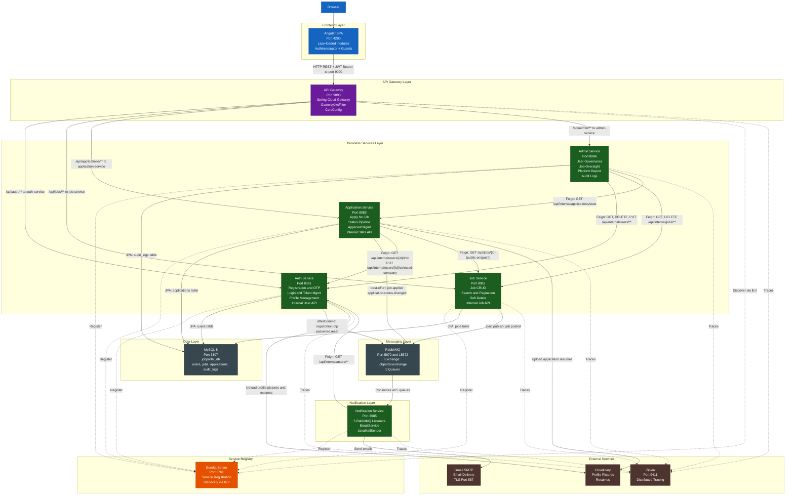
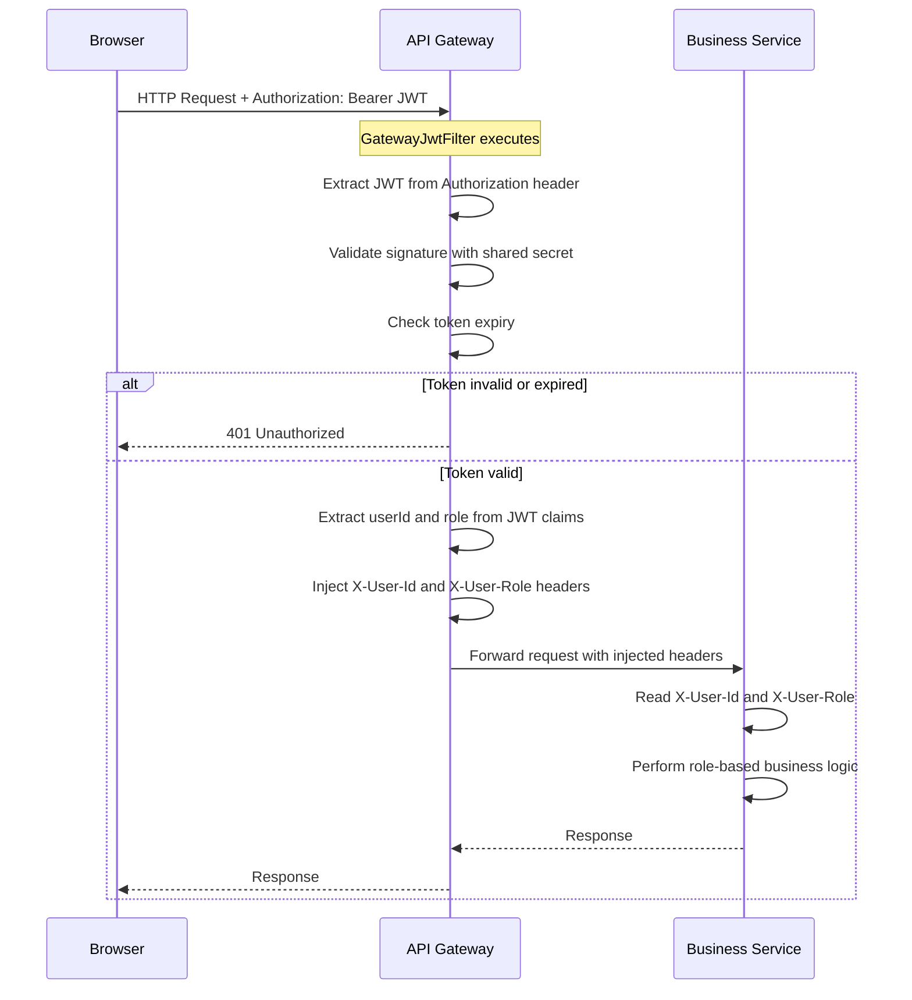
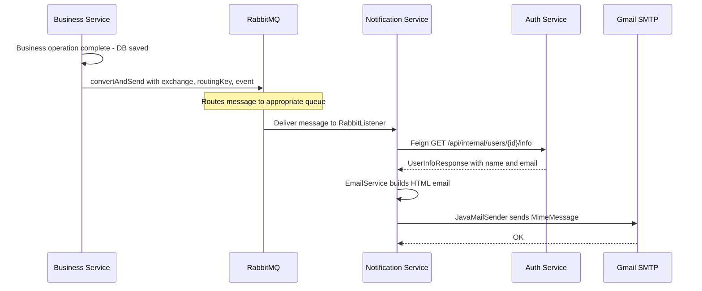
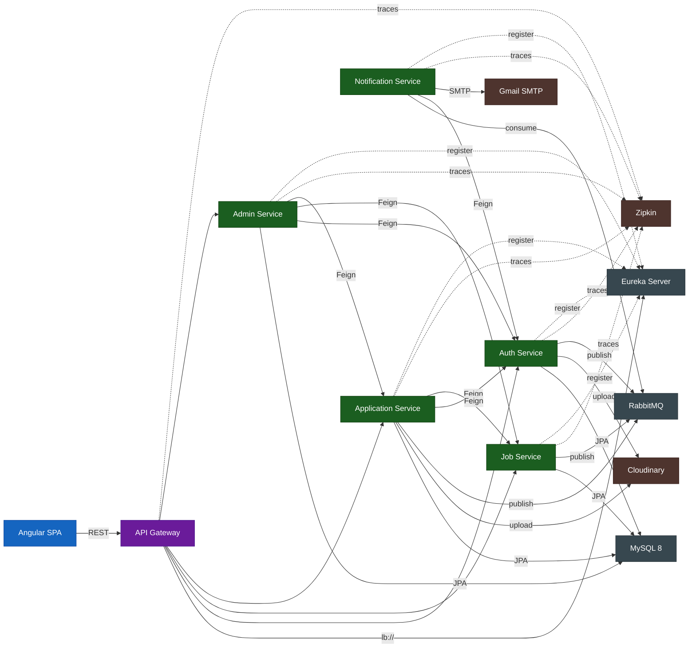
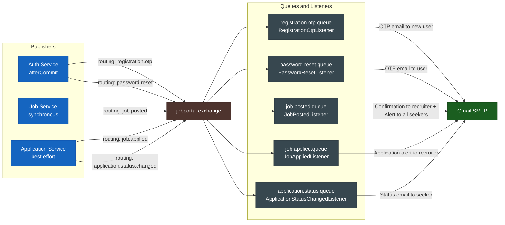

# Architecture Diagram — Joblix Job Portal Management System

---

## Architectural Patterns

| Pattern | Implementation | Key Detail |
|---|---|---|
| API Gateway | Spring Cloud Gateway (reactive) | GatewayJwtFilter at Order=-1; injects X-User-Id and X-User-Role |
| Service Discovery | Netflix Eureka (client-side load balancing) | All services register; Feign uses lb://service-name |
| Event-Driven Architecture | RabbitMQ jobportal.exchange, 5 queues | Auth uses afterCommit(); Job uses sync publish; App uses best-effort |
| Synchronous Inter-Service | OpenFeign declarative HTTP clients | Resolved via Eureka — bypasses API Gateway entirely |
| Stateless Authentication | JWT (HMAC-SHA256) + UUID refresh token | Refresh token stored in DB; rotated on every /api/auth/refresh |
| External Storage Delegation | Cloudinary SDK | Used by Auth Service (profile pic + resume) and Application Service |
| Shared Database | Single MySQL 8 jobportal_db | No cross-service FK constraints at DB level |
| Distributed Tracing | Zipkin (optional) | Micrometer integration; services start even if Zipkin is unavailable |

---

## Full Architecture Diagram



---

## Authenticated Request Flow



---

## Event-Driven Notification Flow



---

## Component Dependency Map



---

## Service Topology Summary

| Service | Port | Role | DB Tables | Publishes | Consumes | Feign Clients | Publish Timing |
|---|---|---|---|---|---|---|---|
| Eureka Server | 8761 | Infrastructure | none | none | none | none | none |
| API Gateway | 9090 | Infrastructure | none | none | none | none | none |
| Auth Service | 8081 | Business | users | registration.otp, password.reset | none | None | afterCommit() |
| Job Service | 8082 | Business | jobs | job.posted | none | None | synchronous |
| Application Service | 8083 | Business | applications | job.applied, application.status.changed | none | AuthServiceClient, JobServiceClient | best-effort |
| Admin Service | 8084 | Business | audit_logs | none | none | AuthServiceClient, AdminJobClient, AdminAppClient | none |
| Notification Service | 8085 | Business | none | none | All 5 queues | AuthServiceClient | none |
| Zipkin | 9411 | Infrastructure | none | none | none | none | none |
| MySQL 8 | 3307 | Infrastructure | All 4 tables | none | none | none | none |
| RabbitMQ | 5672/15672 | Infrastructure | none | none | none | none | none |

---

## RabbitMQ Queue Architecture



> **Note:** ApplicationStatusChangedListener only sends emails for SHORTLISTED, SELECTED, and REJECTED. UNDER_REVIEW does NOT trigger any email.

---

## API Gateway Route Table

| Route | Path Predicate | Target Service | Auth Required | Notes |
|---|---|---|---|---|
| auth-service | `/api/auth/**` | lb://auth-service | Partial | register, login, refresh, forgot/reset password are public |
| job-service | `/api/jobs/**` | lb://job-service | Partial | GET /api/jobs, /search, /{id} are public |
| application-service | `/api/applications/**` | lb://application-service | Yes | All require JWT |
| admin-service | `/api/admin/**` | lb://admin-service | Yes (ADMIN) | All require JWT + ADMIN role |
| auth-service-internal | `/api/internal/users/**` | lb://auth-service | Blocked 403 | Feign-only |
| job-service-internal | `/api/internal/jobs/**` | lb://job-service | Blocked 403 | Feign-only |
| app-service-internal | `/api/internal/applications/**` | lb://application-service | Blocked 403 | Feign-only |

---

## Frontend Module Architecture

```
Angular SPA (jpms-frontend)
│
├── AppModule (root)
│   ├── AppRoutingModule (lazy routes)
│   └── CoreModule
│       ├── AuthService (BehaviorSubject<User>)
│       ├── AuthInterceptor (JWT attach + 401 refresh)
│       ├── AuthGuard (isLoggedIn check)
│       ├── RoleGuard (role array check)
│       └── ToastService / LoaderService
│
├── LayoutModule (shell, header, footer, sidebar)
│
└── Features (Lazy-Loaded)
    ├── HomeModule (/home)
    ├── AuthModule (/auth)
    ├── SeekerModule (/seeker)
    │   ├── SeekerDashboard
    │   ├── BrowseJobs
    │   ├── JobDetail + Apply Modal
    │   ├── MyApplications
    │   └── SeekerProfile
    ├── RecruiterModule (/recruiter)
    │   ├── RecruiterDashboard
    │   ├── PostJob / MyJobs / EditJob
    │   ├── ViewApplicants (ATS panel + PDF preview)
    │   └── RecruiterProfile
    └── AdminModule (/admin)
        ├── AdminDashboard
        ├── UserManagement / JobManagement
        ├── PlatformReport (Chart.js)
        ├── AuditLogs
        └── AdminProfile
```
