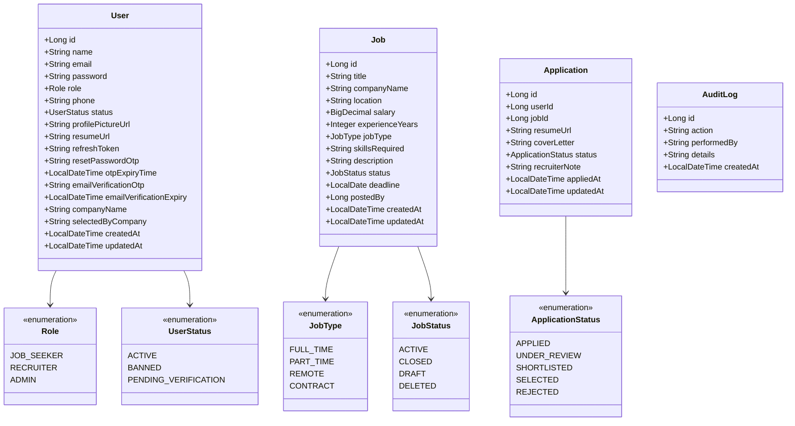
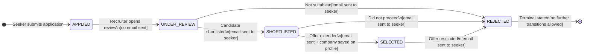
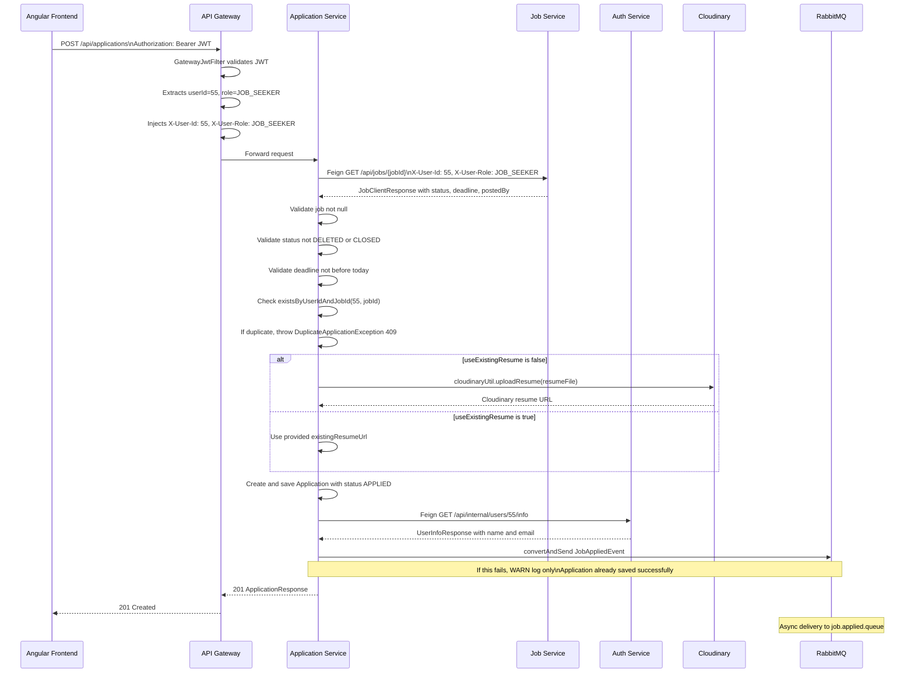
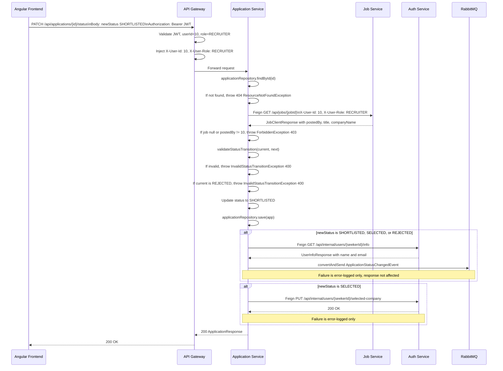
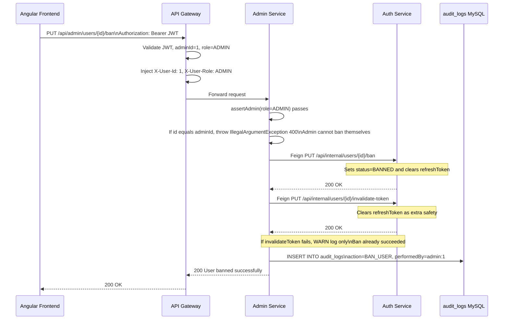

# Low Level Design (LLD) — Joblix Job Portal Management System

---

## 1. Module Breakdown

### 1.1 Auth Service

| Class | Package | Key Responsibilities |
|---|---|---|
| `AuthController` | controller | 12 endpoints: register, verify-registration, resend-registration-otp, login, refresh, logout, update-picture, update-resume, get-profile, update-company-name, forgot-password, reset-password |
| `InternalAuthController` | controller | 7 endpoints (Feign-only): getAllUsers, deleteUser, banUser, unbanUser, invalidateToken, getJobSeekerEmails, getUserInfo, updateSelectedByCompany |
| `AuthService` | service | 16 methods; uses `TransactionSynchronizationManager.afterCommit()` for OTP event publishing |
| `JwtUtil` | security | generateAccessToken(userId, role), generateRefreshToken(), isTokenValid(), extractUserId(), extractRole() |
| `CloudinaryUtil` | util | uploadProfilePicture(MultipartFile), uploadResume(MultipartFile) |
| `User` | entity | 18 columns; `@PrePersist` sets createdAt; `@PreUpdate` sets updatedAt |
| `UserRepository` | dao | findByEmail, findByRefreshToken, findByRole, findById |
| `GlobalExceptionHandler` | exception | Maps: UserAlreadyExistsException to 409, ResourceNotFoundException to 404, IllegalArgumentException to 400 |

### 1.2 Job Service

| Class | Package | Key Responsibilities |
|---|---|---|
| `JobController` | controller | 7 endpoints: POST /api/jobs, GET /api/jobs, GET /api/jobs/{id}, GET /api/jobs/search, PUT /api/jobs/{id}, DELETE /api/jobs/{id}, GET /api/jobs/my-jobs |
| `InternalJobController` | controller | 2 endpoints (Feign-only): GET /api/internal/jobs/all, DELETE /api/internal/jobs/{id} |
| `JobService` | service | 8 methods; `postJob()` does synchronous RabbitMQ publish after `jobRepository.save()` |
| `JobRepository` | repository | findByStatusNot(DELETED, pageable), findByIdAndStatusNot(id, DELETED), findByPostedByAndStatusNot, searchJobs, findAll |

### 1.3 Application Service

| Class | Package | Key Responsibilities |
|---|---|---|
| `ApplicationController` | controller | 6 endpoints: POST, GET my, GET by id, GET by job, PATCH status, DELETE |
| `InternalApplicationController` | controller | 1 endpoint (Feign-only): GET /api/internal/applications/stats |
| `ApplicationService` | service | 6 methods; notification failure is silently caught; `getApplicationStats()` omits SELECTED |
| `ApplicationRepository` | dao | existsByUserIdAndJobId, findByUserId, findByJobId, findByIdAndUserId, findAll |
| `AuthServiceClient` | client | getUserInfo(userId), updateSelectedByCompany(seekerId, Map body) |
| `JobServiceClient` | client | getJobById(id, X-User-Id header, X-User-Role header) — calls /api/jobs/{id} public endpoint |

### 1.4 Admin Service

| Class | Package | Key Responsibilities |
|---|---|---|
| `AdminController` | controller | 8 endpoints; all validate `assertAdmin(role)` at controller level |
| `AdminService` | service | Orchestrates Feign calls; writes AuditLog; banUser() has self-ban check |
| `AuditLogRepository` | repository | Standard JPA findAll(); no custom queries |
| `AuthServiceClient` | client | getAllUsers(), deleteUser(id), banUser(id), unbanUser(id), invalidateToken(id) |
| `AdminJobClient` | client | getAllJobs() to /api/internal/jobs/all, deleteJob(id) to DELETE /api/internal/jobs/{id} |
| `AdminAppClient` | client | getStats() to /api/internal/applications/stats |

### 1.5 Notification Service

| Class | Package | Key Responsibilities |
|---|---|---|
| `JobPostedListener` | listener | job.posted.queue; fetches recruiter via Feign, sends confirmation; fetches all seeker emails, sends job alert |
| `JobAppliedListener` | listener | job.applied.queue; fetches recruiter via Feign, sends application alert |
| `ApplicationStatusChangedListener` | listener | application.status.queue; routes to sendShortlistedEmail, sendRejectedEmail, or sendSelectedEmail |
| `PasswordResetListener` | listener | password.reset.queue; calls emailService.sendPasswordResetEmail() |
| `RegistrationOtpListener` | listener | registration.otp.queue; calls emailService.sendRegistrationOtpEmail() |
| `EmailService` | service | JavaMailSender with HTML-formatted emails per event type |
| `AuthServiceClient` | client | getUserInfo(id), getJobSeekerEmails() |

---

## 2. Class Diagram (Core Domain)



---

## 3. Application Status State Machine



---

## 4. Sequence Diagram — Apply for Job



---

## 5. Sequence Diagram — Update Application Status



---

## 6. Sequence Diagram — Admin Ban User



---

## 7. API Contract Reference

### Auth Service Endpoints

| Method | Path | Auth | Request | Response |
|---|---|---|---|---|
| POST | `/api/auth/register` | No | name, email, password, role, phone | 200 message / 409 |
| POST | `/api/auth/verify-registration` | No | email, otp | 200 message / 400 |
| POST | `/api/auth/resend-registration-otp` | No | email | 200 / 400 |
| POST | `/api/auth/login` | No | email, password | 200 AuthResponse / 400 |
| POST | `/api/auth/refresh` | No | refreshToken | 200 AuthResponse / 404 |
| POST | `/api/auth/logout` | No | refreshToken | 200 / 404 |
| POST | `/api/auth/forgot-password` | No | email | 200 / 404 |
| POST | `/api/auth/reset-password` | No | email, otp, newPassword | 200 / 400 |
| PUT | `/api/auth/profile/picture` | Yes | multipart picture | 200 profilePictureUrl |
| PUT | `/api/auth/profile/resume` | Yes | multipart resume | 200 resumeUrl |
| GET | `/api/auth/profile` | Yes | — | 200 UserProfileResponse |
| PUT | `/api/auth/profile/company-name` | Yes | companyName | 200 |

### Job Service Endpoints

| Method | Path | Auth | Notes |
|---|---|---|---|
| POST | `/api/jobs` | Yes (RECRUITER) | Returns 201 JobResponseDTO; publishes JobPostedEvent |
| GET | `/api/jobs` | No | Paginated, excludes DELETED |
| GET | `/api/jobs/search` | No | Params: title, location, jobType, experienceYears |
| GET | `/api/jobs/{id}` | No | 404 if DELETED |
| PUT | `/api/jobs/{id}` | Yes (RECRUITER) | Ownership check + all fields overwrite |
| DELETE | `/api/jobs/{id}` | Yes (RECRUITER) | Soft-delete (status=DELETED) |
| GET | `/api/jobs/my-jobs` | Yes (RECRUITER) | Paginated, excludes DELETED |

### Application Service Endpoints

| Method | Path | Auth | Notes |
|---|---|---|---|
| POST | `/api/applications` | Yes (SEEKER) | multipart form; validates job + duplicate |
| GET | `/api/applications/my` | Yes (SEEKER) | All applications by seeker |
| GET | `/api/applications/{id}` | Yes (SEEKER) | Own applications only |
| GET | `/api/applications/job/{jobId}` | Yes (RECRUITER) | Enriched with seeker name/email |
| PATCH | `/api/applications/{id}/status` | Yes (RECRUITER) | Body: newStatus, optional recruiterNote |
| DELETE | `/api/applications/{id}` | Yes (RECRUITER) | Hard delete; ownership check |

### Admin Service Endpoints

| Method | Path | Auth | Notes |
|---|---|---|---|
| GET | `/api/admin/users` | Yes (ADMIN) | All users via Feign |
| DELETE | `/api/admin/users/{id}` | Yes (ADMIN) | Hard delete + audit log |
| PUT | `/api/admin/users/{id}/ban` | Yes (ADMIN) | Feign: ban + invalidateToken + audit log |
| PUT | `/api/admin/users/{id}/unban` | Yes (ADMIN) | Feign: unban + audit log |
| GET | `/api/admin/jobs` | Yes (ADMIN) | All jobs including DELETED via Feign |
| DELETE | `/api/admin/jobs/{id}` | Yes (ADMIN) | Soft-delete via Feign + audit log |
| GET | `/api/admin/reports` | Yes (ADMIN) | Aggregated PlatformReport via 3 Feign calls |
| GET | `/api/admin/audit-logs` | Yes (ADMIN) | All audit_logs records |

---

## 8. Exception Handling

| Exception Class | Service | HTTP Status | Trigger |
|---|---|---|---|
| `UserAlreadyExistsException` | Auth | 409 Conflict | Email already ACTIVE/BANNED |
| `ResourceNotFoundException` | Auth/Job/App | 404 Not Found | Entity not found |
| `IllegalArgumentException` | Auth/Admin/App | 400 Bad Request | Invalid OTP, self-ban, invalid credentials |
| `ForbiddenException` | Job/App | 403 Forbidden | Role mismatch, ownership check failure |
| `DuplicateApplicationException` | App | 409 Conflict | Seeker already applied to same job |
| `InvalidStatusTransitionException` | App | 400 Bad Request | Invalid state machine transition |
| `AccessDeniedException` | Admin | 403 Forbidden | assertAdmin() fails |
| `MaxUploadSizeExceededException` | App | 413 Payload Too Large | Resume file over 5MB |
| JWT validation failure | Gateway | 401 Unauthorized | GatewayJwtFilter — response set directly |
| Internal path access | Gateway | 403 Forbidden | GatewayJwtFilter blocks /api/internal/** |

---

## 9. Internal Dependency Flows

### ApplicationService.applyForJob() chain

```
applyForJob(jobId, coverLetter, useExistingResume, existingResumeUrl, resumeFile, seekerId)
  1. jobServiceClient.getJobById(jobId, seekerId, JOB_SEEKER)  --> Feign: /api/jobs/{id}
  2. Validate job status (DELETED/CLOSED) and deadline
  3. applicationRepository.existsByUserIdAndJobId(seekerId, jobId)  --> Duplicate check
  4. [if not useExistingResume] cloudinaryUtil.uploadResume(resumeFile)
  5. applicationRepository.save(application)
  6. authServiceClient.getUserInfo(seekerId)  --> Feign: /api/internal/users/{id}/info
  7. rabbitTemplate.convertAndSend(exchange, routingKey, JobAppliedEvent)
     [on failure] WARN log only -- application success guaranteed
```

### ApplicationService.updateApplicationStatus() chain

```
updateApplicationStatus(id, StatusUpdateRequest, recruiterId)
  1. applicationRepository.findById(id)
  2. jobServiceClient.getJobById(app.jobId, recruiterId, RECRUITER)  --> Ownership verify
  3. If job null or postedBy != recruiterId --> ForbiddenException
  4. validateStatusTransition(current, next)  --> State machine check
  5. applicationRepository.save(app)
  6. [if SHORTLISTED or SELECTED or REJECTED]
     a. authServiceClient.getUserInfo(app.userId)
     b. rabbitTemplate.convertAndSend(exchange, statusRoutingKey, event)
  7. [if SELECTED]
     a. authServiceClient.updateSelectedByCompany(seekerId, companyName)
        [on failure] error log only
```

### AdminService.banUser() chain

```
banUser(id, adminId)
  1. If id equals adminId --> IllegalArgumentException (self-ban blocked)
  2. authServiceClient.banUser(id)         --> PUT /api/internal/users/{id}/ban
  3. authServiceClient.invalidateToken(id) --> PUT /api/internal/users/{id}/invalidate-token
     [on failure] WARN log only
  4. auditLogRepository.save(AuditLog BAN_USER)
```
