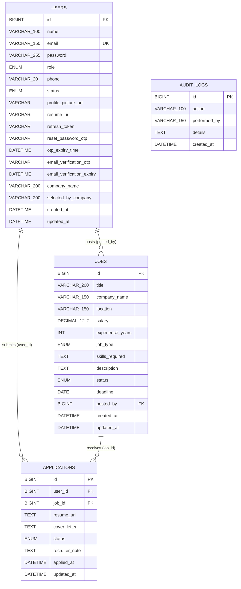

# Database Design / ER Diagram — Joblix Job Portal Management System

---

## 1. Overview

- **DBMS:** MySQL 8
- **Database name:** `jobportal_db`
- **Schema management:** JPA `ddl-auto: update` (auto-creates/updates tables on startup)
- **Shared database:** All microservices connect to the same database instance but own separate table namespaces
- **Character set:** UTF-8 (MySQL default for `varchar` columns)

---

## 2. Entity Definitions

### 2.1 `users` Table (managed by Auth Service)

| Column | Data Type | Constraints | Description |
|---|---|---|---|
| `id` | BIGINT | PK, AUTO_INCREMENT, NOT NULL | Surrogate primary key |
| `name` | VARCHAR(100) | NOT NULL | User's full name |
| `email` | VARCHAR(150) | NOT NULL, UNIQUE | Login identifier; globally unique |
| `password` | VARCHAR(255) | NOT NULL | BCrypt hashed password |
| `role` | ENUM('JOB_SEEKER','RECRUITER','ADMIN') | NOT NULL | User role; stored as string via `@Enumerated(STRING)` |
| `phone` | VARCHAR(20) | NULL | Optional contact number |
| `status` | ENUM('ACTIVE','BANNED','PENDING_VERIFICATION') | NOT NULL, DEFAULT 'ACTIVE' | Account lifecycle state |
| `profile_picture_url` | VARCHAR(500) | NULL | Cloudinary URL for profile picture |
| `resume_url` | VARCHAR(500) | NULL | Cloudinary URL for uploaded resume |
| `refresh_token` | VARCHAR(255) | NULL | UUID refresh token; null after logout/ban |
| `reset_password_otp` | VARCHAR(10) | NULL | 6-digit OTP for password reset; null after use |
| `otp_expiry_time` | DATETIME | NULL | Expiry for reset OTP (10-min window) |
| `email_verification_otp` | VARCHAR(10) | NULL | 6-digit OTP for registration verification |
| `email_verification_expiry` | DATETIME | NULL | Expiry for registration OTP (10-min window) |
| `company_name` | VARCHAR(200) | NULL | Recruiter's company; set at registration |
| `selected_by_company` | VARCHAR(200) | NULL | Set when application status → SELECTED (denormalized) |
| `created_at` | DATETIME | NOT NULL, non-updatable | Auto-set on INSERT via `@PrePersist` |
| `updated_at` | DATETIME | NOT NULL | Auto-updated on UPDATE via `@PreUpdate` |

**Indexes:**
- PRIMARY KEY (`id`)
- UNIQUE KEY `UKr_email` (`email`)

---

### 2.2 `jobs` Table (managed by Job Service)

| Column | Data Type | Constraints | Description |
|---|---|---|---|
| `id` | BIGINT | PK, AUTO_INCREMENT, NOT NULL | Surrogate primary key |
| `title` | VARCHAR(200) | NOT NULL | Job title |
| `company_name` | VARCHAR(150) | NOT NULL | Posting company |
| `location` | VARCHAR(150) | NOT NULL | Job location |
| `salary` | DECIMAL(12,2) | NULL | Annual salary |
| `experience_years` | INT | NULL | Minimum years of experience required |
| `job_type` | ENUM('FULL_TIME','PART_TIME','REMOTE','CONTRACT') | NOT NULL | Employment type |
| `skills_required` | TEXT | NULL | Comma-separated or free-text skills |
| `description` | TEXT | NOT NULL | Full job description |
| `status` | ENUM('ACTIVE','CLOSED','DRAFT','DELETED') | NOT NULL, DEFAULT 'ACTIVE' | Job lifecycle state |
| `deadline` | DATE | NULL | Application submission deadline |
| `posted_by` | BIGINT | NOT NULL, FK (logical) → `users.id` | Recruiter who posted the job |
| `created_at` | DATETIME | NOT NULL | Auto-set on INSERT |
| `updated_at` | DATETIME | NOT NULL | Auto-updated on UPDATE |

> **Note:** `posted_by` is a logical FK to `users.id` — no enforced DB-level `FOREIGN KEY` constraint as services own separate schemas. Referential integrity is enforced at the application layer.

**Indexes:**
- PRIMARY KEY (`id`)

---

### 2.3 `applications` Table (managed by Application Service)

| Column | Data Type | Constraints | Description |
|---|---|---|---|
| `id` | BIGINT | PK, AUTO_INCREMENT, NOT NULL | Surrogate primary key |
| `user_id` | BIGINT | NOT NULL, FK (logical) → `users.id` | Job seeker who applied |
| `job_id` | BIGINT | NOT NULL, FK (logical) → `jobs.id` | Job applied for |
| `resume_url` | TEXT | NOT NULL | Cloudinary URL for the resume submitted with this application |
| `cover_letter` | TEXT | NULL | Optional candidate cover letter |
| `status` | ENUM('APPLIED','UNDER_REVIEW','SHORTLISTED','SELECTED','REJECTED') | NOT NULL, DEFAULT 'APPLIED' | Current pipeline stage |
| `recruiter_note` | TEXT | NULL | Optional recruiter feedback |
| `applied_at` | DATETIME | NOT NULL, non-updatable | Timestamp of initial application |
| `updated_at` | DATETIME | NOT NULL | Timestamp of last status update |

**Constraints:**
- PRIMARY KEY (`id`)
- UNIQUE KEY `uk_user_job` (`user_id`, `job_id`) — prevents duplicate applications

---

### 2.4 `audit_logs` Table (managed by Admin Service)

| Column | Data Type | Constraints | Description |
|---|---|---|---|
| `id` | BIGINT | PK, AUTO_INCREMENT, NOT NULL | Surrogate primary key |
| `action` | VARCHAR(100) | NOT NULL | Action type: DELETE_USER, BAN_USER, UNBAN_USER, DELETE_JOB |
| `performed_by` | VARCHAR(150) | NOT NULL | Format: "admin:{adminId}" |
| `details` | TEXT | NULL | Human-readable description of the action |
| `created_at` | DATETIME | NOT NULL | Auto-set on INSERT via `@PrePersist` |

**Indexes:**
- PRIMARY KEY (`id`)

---

## 3. ER Diagram

---

## 4. Relationship Summary

| Relationship | Cardinality | Description |
|---|---|---|
| `USERS` → `JOBS` | 1 : Many | One Recruiter can post many Jobs (`jobs.posted_by` → `users.id`) |
| `USERS` → `APPLICATIONS` | 1 : Many | One Job Seeker can submit many Applications (`applications.user_id` → `users.id`) |
| `JOBS` → `APPLICATIONS` | 1 : Many | One Job can receive many Applications (`applications.job_id` → `jobs.id`) |
| `USERS` + `JOBS` → `APPLICATIONS` | Many : Many (resolved) | Bridged by `APPLICATIONS` table with UNIQUE(user_id, job_id) |

---

## 5. Enum Values Per Column

| Table | Column | Allowed Values |
|---|---|---|
| `users` | `role` | `JOB_SEEKER`, `RECRUITER`, `ADMIN` |
| `users` | `status` | `ACTIVE`, `BANNED`, `PENDING_VERIFICATION` |
| `jobs` | `job_type` | `FULL_TIME`, `PART_TIME`, `REMOTE`, `CONTRACT` |
| `jobs` | `status` | `ACTIVE`, `CLOSED`, `DRAFT`, `DELETED` |
| `applications` | `status` | `APPLIED`, `UNDER_REVIEW`, `SHORTLISTED`, `SELECTED`, `REJECTED` |

---

## 6. Cross-Service Data Consistency Notes

Since all services share one MySQL instance but have no enforced FK constraints across service boundaries, referential integrity is maintained at the application layer:

| Cross-Service Reference | Enforcement |
|---|---|
| `jobs.posted_by` → `users.id` | Enforced by Gateway JWT: only authenticated RECRUITER can post a job |
| `applications.user_id` → `users.id` | Enforced by Gateway JWT: only authenticated JOB_SEEKER can apply |
| `applications.job_id` → `jobs.id` | Enforced by Feign call in ApplicationService: job must exist and be ACTIVE |
| `users.selected_by_company` update | Triggered by ApplicationService via Feign when status → SELECTED |

---

## 7. Schema Notes

- **ddl-auto: update** — JPA auto-creates or alters tables on application startup. No migration framework (Flyway/Liquibase) is used.
- **Soft Delete (Jobs):** Jobs set to `status=DELETED` via recruiter delete. Admin delete cascades via Feign to perform a hard delete on the record.
- **Audit Log immutability:** `audit_logs.created_at` is set via `@PrePersist` and is never updated. There is no UPDATE pathway for audit log records.
- **OTP lifecycle:** Both `reset_password_otp`/`otp_expiry_time` and `email_verification_otp`/`email_verification_expiry` are set to `null` after successful verification to prevent reuse.
- **Token lifecycle:** `refresh_token` is set to `null` on logout, ban, and after rotation (new token replaces old).
